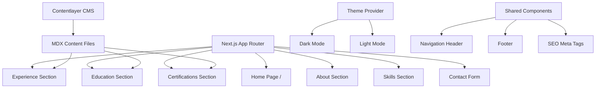

# Next.js Portfolio Website Plan

## Tech Stack

- **Framework**: Next.js 15 (App Router)
- **Language**: TypeScript
- **Styling**: Tailwind CSS + Shadcn UI
- **Animations**: Framer Motion
- **CMS**: Contentlayer (for markdown-based content management)
- **SEO**: Next.js Metadata API
- **Analytics**: Vercel Analytics
- **Deployment**: Vercel

## Architecture Overview




## Project Structure

The portfolio will follow Next.js App Router conventions:

```
/
├── app/
│   ├── layout.tsx (Root layout with theme provider)
│   ├── page.tsx (Home/Landing page)
│   ├── globals.css (Tailwind + custom styles)
│   └── api/
│       └── contact/route.ts (Contact form endpoint)
├── components/
│   ├── ui/ (Shadcn UI components)
│   ├── sections/
│   │   ├── Hero.tsx
│   │   ├── About.tsx
│   │   ├── Experience.tsx
│   │   ├── Skills.tsx
│   │   ├── Education.tsx
│   │   ├── Certifications.tsx
│   │   └── Contact.tsx
│   ├── Header.tsx
│   └── Footer.tsx
├── content/
│   ├── experience/ (MDX files for work experience)
│   ├── education/ (MDX files for education)
│   └── certifications/ (MDX files for certifications)
├── lib/
│   └── utils.ts (Utility functions)
├── public/
│   ├── resume.pdf (Downloadable resume)
│   └── images/
└── contentlayer.config.ts
```

## Key Features Implementation

### 1. Dark Mode

- Use `next-themes` for theme management
- Persistent theme preference in localStorage
- Smooth theme transitions with Tailwind classes
- Toggle button in header with sun/moon icons

### 2. Animations

- Framer Motion for scroll animations
- Fade-in effects for sections on scroll
- Smooth hover effects on interactive elements
- Page transition animations

### 3. SEO Optimization

- Next.js Metadata API for dynamic meta tags
- Open Graph and Twitter Card tags
- Structured data (JSON-LD) for rich snippets
- Optimized images with Next.js Image component
- Sitemap and robots.txt generation

### 4. CMS Integration (Contentlayer)

- Markdown/MDX files for content management
- Type-safe content with auto-generated TypeScript types
- Easy content updates without touching code
- Support for frontmatter metadata

### 5. Contact Form

- Server-side API route for form submission
- Form validation using React Hook Form + Zod
- Email integration (Resend or Nodemailer)
- Success/error toast notifications

### 6. Downloadable Resume

- PDF resume in `/public/resume.pdf`
- Download button with icon
- Track downloads with analytics

## Section Details

### Hero Section

- Full-screen landing with animated name/title
- Brief tagline about your role (e.g., "Full-Stack Developer")
- CTA buttons: "View Work" and "Download Resume"
- Animated background gradient or particles effect
- Social media links (GitHub, LinkedIn, etc.)

### About Section

- Professional photo/avatar
- Bio paragraph from resume
- Current role and location
- Tech-focused aesthetic with code-like elements
- Technologies/tools showcase with icons

### Experience Section

- Timeline layout showing work history
- Each job as a card with:
  - Company name and logo
  - Position title
  - Date range
  - Key responsibilities and achievements
  - Technologies used
- Managed via MDX files in `/content/experience/`

### Skills Section

- Categorized skill groups:
  - Languages (JavaScript, TypeScript, Python, etc.)
  - Frameworks (React, Next.js, Node.js, etc.)
  - Tools & Technologies (Git, Docker, AWS, etc.)
  - Soft Skills (optional)
- Interactive skill badges with hover effects
- Proficiency indicators (optional)

### Education Section

- University/institution cards
- Degree, major, graduation year
- Relevant coursework or achievements
- Managed via MDX files in `/content/education/`

### Certifications Section

- Certificate cards with:
  - Certification name
  - Issuing organization
  - Date obtained
  - Credential ID/link to verify
  - Badge/logo if available
- Managed via MDX files in `/content/certifications/`

### Contact Section

- Contact form with fields:
  - Name (required)
  - Email (required)
  - Subject (optional)
  - Message (required)
- Alternative contact methods (email, LinkedIn)
- Social media links
- Form submission to API route

## Design System

### Color Palette (Tech-Focused)

- **Dark Mode Primary**: Deep navy/charcoal background (#0a0a0f)
- **Dark Mode Secondary**: Slate gray (#1a1a2e)
- **Accent**: Electric blue (#00d4ff) or neon green (#39ff14)
- **Text**: White/off-white (#f8f8f8)
- **Light Mode**: Clean white background with dark text

### Typography

- **Headings**: Inter or Space Grotesk (bold, modern)
- **Body**: Inter or system font stack
- **Code**: JetBrains Mono or Fira Code (for tech aesthetic)

### Components

- Use Shadcn UI components: Button, Card, Badge, Input, Textarea
- Custom components for sections
- Consistent spacing and padding (Tailwind spacing scale)
- Responsive breakpoints: mobile-first approach

## Configuration Files

### Essential Dependencies

```json
{
  "dependencies": {
    "next": "^15.0.0",
    "react": "^19.0.0",
    "react-dom": "^19.0.0",
    "contentlayer2": "^0.5.0",
    "next-contentlayer2": "^0.5.0",
    "framer-motion": "^11.0.0",
    "next-themes": "^0.4.0",
    "react-hook-form": "^7.53.0",
    "zod": "^3.23.0",
    "@hookform/resolvers": "^3.9.0",
    "lucide-react": "^0.460.0",
    "class-variance-authority": "^0.7.0",
    "clsx": "^2.1.0",
    "tailwind-merge": "^2.6.0",
    "@vercel/analytics": "^1.4.0"
  }
}
```

### Tailwind Configuration

- Custom dark mode colors
- Extended spacing for sections
- Custom animations for fade-ins
- Typography plugin for better text rendering

### TypeScript Configuration

- Strict mode enabled
- Path aliases: `@/` for root imports
- Proper types for Contentlayer content

## Responsive Design

- **Mobile (< 640px)**: Single column, stacked sections, hamburger menu
- **Tablet (640px - 1024px)**: Two-column grid where appropriate
- **Desktop (> 1024px)**: Full layout with fixed header, multi-column grids

## Performance Optimizations

- Next.js Image component for optimized images
- Dynamic imports for heavy components (e.g., animations)
- Static generation for all pages (ISG where needed)
- Minimal JavaScript bundle with code splitting
- Preload critical assets
- Lazy load images below the fold

## SEO Strategy

- Dynamic metadata per page
- Semantic HTML structure (header, main, section, footer)
- Alt text for all images
- Fast loading times (< 2s LCP)
- Mobile-friendly (responsive design)
- Schema.org structured data for Person type

## Deployment Setup

### Vercel Configuration

- Automatic deployments from Git repository
- Environment variables for API keys (contact form, analytics)
- Custom domain setup (if applicable)
- Vercel Analytics enabled by default

### Environment Variables Needed

```
RESEND_API_KEY=your_key_here
CONTACT_EMAIL=your_email@example.com
NEXT_PUBLIC_SITE_URL=https://yourportfolio.com
```

## Development Workflow

1. **Initial Setup**: Install dependencies, configure Tailwind + Shadcn
2. **Core Structure**: Create app layout, pages, and routing
3. **Theme System**: Implement dark/light mode with next-themes
4. **UI Components**: Install and customize Shadcn UI components
5. **Sections Development**: Build each section component (Hero → Contact)
6. **CMS Setup**: Configure Contentlayer for content management
7. **Content Integration**: Connect CMS data to components
8. **Animations**: Add Framer Motion animations to sections
9. **Contact Form**: Implement form with validation and API route
10. **SEO**: Add metadata, structured data, sitemap
11. **Analytics**: Integrate Vercel Analytics
12. **Testing**: Cross-browser testing, responsive testing, accessibility
13. **Optimization**: Performance audit, image optimization, bundle analysis
14. **Deployment**: Deploy to Vercel, configure custom domain

## Content Management

After the initial build, you can easily update content by:

- Editing MDX files in `/content/` directories
- Updating the resume PDF in `/public/`
- The site will automatically rebuild and redeploy on Git push

## Accessibility

- Semantic HTML elements
- ARIA labels where needed
- Keyboard navigation support
- Focus indicators on interactive elements
- Color contrast compliance (WCAG AA)
- Alt text for images

## Browser Support

- Modern browsers (Chrome, Firefox, Safari, Edge)
- Last 2 versions
- No IE11 support (Next.js 15 requirement)

